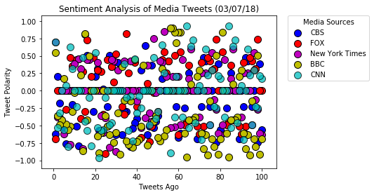
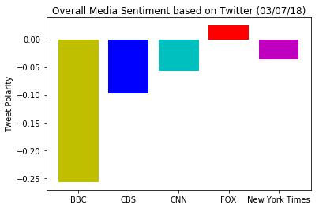

```python
# Dependencies
import tweepy
import json
import numpy as np
from datetime import datetime
import matplotlib.pyplot as plt
import pandas as pd

# Import and Initialize Sentiment Analyzer
from vaderSentiment.vaderSentiment import SentimentIntensityAnalyzer
analyzer = SentimentIntensityAnalyzer()

# Twitter API Keys
consumer_key = 'G68lS9eVTMPXmqDt1VWi1VKDc'
consumer_secret = 'bEUBgL7D81Eejb4HdNVv8fL7q1Fl6CVi6kkl7BzqFUFnFU4Fpz'
access_token = '2834495910-zgqP8NV4OoeLxIinsAil6obmHUBDKL24bQCXQ9r'
access_token_secret = 'FOa7EQOsZElKEVRt58doC4BTupGZbqW8RvLzhXgVYU8d8'

# Setup Tweepy API Authentication
auth = tweepy.OAuthHandler(consumer_key, consumer_secret)
auth.set_access_token(access_token, access_token_secret)
api = tweepy.API(auth, parser=tweepy.parsers.JSONParser())
```

# BBC Tweets


```python
target_user = '@BBCBreaking'

BBC_compound_list = []
BBC_positive_list = []
BBC_negative_list = []
BBC_neutral_list = []
BBC_text = []
BBC_date = []
BBC_Account = []

for x in range(5):

    BBC_tweets = api.user_timeline(target_user, page=x)

    for tweet in BBC_tweets:

        # Run Vader Analysis on each tweet
        compound = analyzer.polarity_scores(tweet['text'])['compound']
        pos = analyzer.polarity_scores(tweet['text'])['pos']
        neu = analyzer.polarity_scores(tweet['text'])['neu']
        neg = analyzer.polarity_scores(tweet['text'])['neg']

        # Add each value to the apporiate list
        BBC_compound_list.append(compound)
        BBC_positive_list.append(pos)
        BBC_negative_list.append(neg)
        BBC_neutral_list.append(neu)
        
        # Get the data for the Dataframe
        BBC_text.append(tweet['text'])
        BBC_date.append(tweet['created_at'])
        BBC_Account.append(tweet['user']['name'])

# Print the Averages

print("")
print("User: %s" % target_user)
print(f"Compound: {np.mean(BBC_compound_list)}")
print(f"Positivity: {np.mean(BBC_positive_list)}")
print(f"Neutral: {np.mean(BBC_neutral_list)}")
print(f"Negative: {np.mean(BBC_negative_list)}")

```

    
    User: @BBCBreaking
    Compound: -0.25749
    Positivity: 0.07069
    Neutral: 0.76138
    Negative: 0.16796000000000003
    

# NY TIMES TWEETS


```python
target_user = '@NYTimes'

NYT_compound_list = []
NYT_positive_list = []
NYT_negative_list = []
NYT_neutral_list = []
NYT_text = []
NYT_date = []
NYT_Account = []

for x in range(5):

    NYT_tweets = api.user_timeline(target_user, page=x)

    for tweet in NYT_tweets:

        # Run Vader Analysis on each tweet
        compound = analyzer.polarity_scores(tweet['text'])['compound']
        pos = analyzer.polarity_scores(tweet['text'])['pos']
        neu = analyzer.polarity_scores(tweet['text'])['neu']
        neg = analyzer.polarity_scores(tweet['text'])['neg']

        # Add each value to the apporiate list
        NYT_compound_list.append(compound)
        NYT_positive_list.append(pos)
        NYT_negative_list.append(neg)
        NYT_neutral_list.append(neu)
        
        # Get the data for the Dataframe
        NYT_text.append(tweet['text'])
        NYT_date.append(tweet['created_at'])
        NYT_Account.append(tweet['user']['name'])

# Print the Averages

print("")
print("User: %s" % target_user)
print(f"Compound: {np.mean(NYT_compound_list)}")
print(f"Positivity: {np.mean(NYT_positive_list)}")
print(f"Neutral: {np.mean(NYT_neutral_list)}")
print(f"Negative: {np.mean(NYT_negative_list)}")
```

    
    User: @NYTimes
    Compound: -0.03610300000000001
    Positivity: 0.06798
    Neutral: 0.8484
    Negative: 0.08358
    

# FOX News Tweets


```python
target_user = '@FoxNews'

FOX_compound_list = []
FOX_positive_list = []
FOX_negative_list = []
FOX_neutral_list = []
FOX_text = []
FOX_date = []
FOX_Account = []

for x in range(5):

    FOX_tweets = api.user_timeline(target_user, page=x)

    for tweet in FOX_tweets:

        # Run Vader Analysis on each tweet
        compound = analyzer.polarity_scores(tweet['text'])['compound']
        pos = analyzer.polarity_scores(tweet['text'])['pos']
        neu = analyzer.polarity_scores(tweet['text'])['neu']
        neg = analyzer.polarity_scores(tweet['text'])['neg']

        # Add each value to the apporiate list
        FOX_compound_list.append(compound)
        FOX_positive_list.append(pos)
        FOX_negative_list.append(neg)
        FOX_neutral_list.append(neu)
        
        # Get the data for the Dataframe
        FOX_text.append(tweet['text'])
        FOX_date.append(tweet['created_at'])
        FOX_Account.append(tweet['user']['name'])

# Print the Averages

print("")
print("User: %s" % target_user)
print(f"Compound: {np.mean(FOX_compound_list)}")
print(f"Positivity: {np.mean(FOX_positive_list)}")
print(f"Neutral: {np.mean(FOX_neutral_list)}")
print(f"Negative: {np.mean(FOX_negative_list)}")
```

    
    User: @FoxNews
    Compound: 0.024857
    Positivity: 0.07824
    Neutral: 0.85181
    Negative: 0.06992999999999999
    

# CNN Tweets


```python
target_user = '@CNN'

CNN_compound_list = []
CNN_positive_list = []
CNN_negative_list = []
CNN_neutral_list = []
CNN_text = []
CNN_date = []
CNN_Account = []

for x in range(5):

    CNN_tweets = api.user_timeline(target_user, page=x)

    for tweet in CNN_tweets:

        # Run Vader Analysis on each tweet
        compound = analyzer.polarity_scores(tweet['text'])['compound']
        pos = analyzer.polarity_scores(tweet['text'])['pos']
        neu = analyzer.polarity_scores(tweet['text'])['neu']
        neg = analyzer.polarity_scores(tweet['text'])['neg']

        # Add each value to the apporiate list
        CNN_compound_list.append(compound)
        CNN_positive_list.append(pos)
        CNN_negative_list.append(neg)
        CNN_neutral_list.append(neu)
        
        # Get the data for the Dataframe
        CNN_text.append(tweet['text'])
        CNN_date.append(tweet['created_at'])
        CNN_Account.append(tweet['user']['name'])

# Print the Averages

print("")
print("User: %s" % target_user)
print(f"Compound: {np.mean(CNN_compound_list)}")
print(f"Positivity: {np.mean(CNN_positive_list)}")
print(f"Neutral: {np.mean(CNN_neutral_list)}")
print(f"Negative: {np.mean(CNN_negative_list)}")
```

    
    User: @CNN
    Compound: -0.05742699999999999
    Positivity: 0.06996
    Neutral: 0.84232
    Negative: 0.08772
    

# CBS News Tweets


```python
target_user = '@CBSNews'

CBS_compound_list = []
CBS_positive_list = []
CBS_negative_list = []
CBS_neutral_list = []
CBS_text = []
CBS_date = []
CBS_Account = []

for x in range(5):

    CBS_tweets = api.user_timeline(target_user, page=x)

    for tweet in CBS_tweets:

        # Run Vader Analysis on each tweet
        compound = analyzer.polarity_scores(tweet['text'])['compound']
        pos = analyzer.polarity_scores(tweet['text'])['pos']
        neu = analyzer.polarity_scores(tweet['text'])['neu']
        neg = analyzer.polarity_scores(tweet['text'])['neg']

        # Add each value to the apporiate list
        CBS_compound_list.append(compound)
        CBS_positive_list.append(pos)
        CBS_negative_list.append(neg)
        CBS_neutral_list.append(neu)
        
        # Get the data for the Dataframe
        CBS_text.append(tweet['text'])
        CBS_date.append(tweet['created_at'])
        CBS_Account.append(tweet['user']['name'])

# Print the Averages

print("")
print("User: %s" % target_user)
print(f"Compound: {np.mean(CBS_compound_list)}")
print(f"Positivity: {np.mean(CBS_positive_list)}")
print(f"Neutral: {np.mean(CBS_neutral_list)}")
print(f"Negative: {np.mean(CBS_negative_list)}")
```

    
    User: @CBSNews
    Compound: -0.098168
    Positivity: 0.040409999999999995
    Neutral: 0.8805600000000001
    Negative: 0.07905
    


```python
tweets_ago = []
for x in range(100):
    tweets_ago.append(x+1)
tweets_ago.reverse()

```


```python
Handles = ['CBS','FOX','New York Times','BBC','CNN']


plt.scatter(tweets_ago, CBS_compound_list, marker='o', edgecolors='k', color='b', s=100, label='CBS')
plt.scatter(tweets_ago, FOX_compound_list, marker='o', edgecolors='k', color='r', s=100, label='FOX')
plt.scatter(tweets_ago, NYT_compound_list, marker='o', edgecolors='k', color='m', s=100, label='New York Times')
plt.scatter(tweets_ago, BBC_compound_list, marker='o', edgecolors='k', color='y', s=100, label='BBC')
plt.scatter(tweets_ago, CNN_compound_list, marker='o', edgecolors='k', color='c', s=100., alpha=.75, label='CNN')
plt.title("Sentiment Analysis of Media Tweets (03/07/18)")
plt.xlabel("Tweets Ago")
plt.ylabel("Tweet Polarity")
plt.legend(bbox_to_anchor=(1.05, 1), loc=2, borderaxespad=0., title="Media Sources")
plt.show()
plt.savefig('Sentiment Analysis of Media Tweets (03/07/18).png')
```





    ---------------------------------------------------------------------------

    FileNotFoundError                         Traceback (most recent call last)

    <ipython-input-112-809c62f3dce1> in <module>()
         12 plt.legend(bbox_to_anchor=(1.05, 1), loc=2, borderaxespad=0., title="Media Sources")
         13 plt.show()
    ---> 14 plt.savefig('Sentiment Analysis of Media Tweets (03/07/18).png')
    

    ~\Anaconda3\lib\site-packages\matplotlib\pyplot.py in savefig(*args, **kwargs)
        695 def savefig(*args, **kwargs):
        696     fig = gcf()
    --> 697     res = fig.savefig(*args, **kwargs)
        698     fig.canvas.draw_idle()   # need this if 'transparent=True' to reset colors
        699     return res
    

    ~\Anaconda3\lib\site-packages\matplotlib\figure.py in savefig(self, fname, **kwargs)
       1812             self.set_frameon(frameon)
       1813 
    -> 1814         self.canvas.print_figure(fname, **kwargs)
       1815 
       1816         if frameon:
    

    ~\Anaconda3\lib\site-packages\matplotlib\backend_bases.py in print_figure(self, filename, dpi, facecolor, edgecolor, orientation, format, **kwargs)
       2257                 orientation=orientation,
       2258                 bbox_inches_restore=_bbox_inches_restore,
    -> 2259                 **kwargs)
       2260         finally:
       2261             if bbox_inches and restore_bbox:
    

    ~\Anaconda3\lib\site-packages\matplotlib\backends\backend_agg.py in print_png(self, filename_or_obj, *args, **kwargs)
        510         renderer.dpi = self.figure.dpi
        511         if isinstance(filename_or_obj, six.string_types):
    --> 512             filename_or_obj = open(filename_or_obj, 'wb')
        513             close = True
        514         else:
    

    FileNotFoundError: [Errno 2] No such file or directory: 'Sentiment Analysis of Media Tweets (03/07/18).png'


```python
sources = ['CBS','FOX','New York Times','BBC','CNN']
cmpd_ratings = [np.mean(CBS_compound_list),np.mean(FOX_compound_list)
               ,np.mean(NYT_compound_list),np.mean(BBC_compound_list),
               np.mean(CNN_compound_list)]
colors = ['b','r','m','y','c']

plt.bar(sources,cmpd_ratings, color=colors,align='center')
plt.title("Overall Media Sentiment based on Twitter (03/07/18)")
plt.ylabel("Tweet Polarity")
plt.show()
plt.savefig(f"Overall Media Sentiment based on Twitter (03/07/18).png", dpi=None, facecolor='w', edgecolor='w',
        orientation='portrait', papertype=None, format=None,
        transparent=False, bbox_inches=None, pad_inches=0.1,
        frameon=None)
```





    ---------------------------------------------------------------------------

    FileNotFoundError                         Traceback (most recent call last)

    <ipython-input-123-26cbc4a0bf05> in <module>()
         12         orientation='portrait', papertype=None, format=None,
         13         transparent=False, bbox_inches=None, pad_inches=0.1,
    ---> 14         frameon=None)
    

    ~\Anaconda3\lib\site-packages\matplotlib\pyplot.py in savefig(*args, **kwargs)
        695 def savefig(*args, **kwargs):
        696     fig = gcf()
    --> 697     res = fig.savefig(*args, **kwargs)
        698     fig.canvas.draw_idle()   # need this if 'transparent=True' to reset colors
        699     return res
    

    ~\Anaconda3\lib\site-packages\matplotlib\figure.py in savefig(self, fname, **kwargs)
       1812             self.set_frameon(frameon)
       1813 
    -> 1814         self.canvas.print_figure(fname, **kwargs)
       1815 
       1816         if frameon:
    

    ~\Anaconda3\lib\site-packages\matplotlib\backend_bases.py in print_figure(self, filename, dpi, facecolor, edgecolor, orientation, format, **kwargs)
       2257                 orientation=orientation,
       2258                 bbox_inches_restore=_bbox_inches_restore,
    -> 2259                 **kwargs)
       2260         finally:
       2261             if bbox_inches and restore_bbox:
    

    ~\Anaconda3\lib\site-packages\matplotlib\backends\backend_agg.py in print_png(self, filename_or_obj, *args, **kwargs)
        510         renderer.dpi = self.figure.dpi
        511         if isinstance(filename_or_obj, six.string_types):
    --> 512             filename_or_obj = open(filename_or_obj, 'wb')
        513             close = True
        514         else:
    

    FileNotFoundError: [Errno 2] No such file or directory: 'Overall Media Sentiment based on Twitter (03/07/18).png'


```python
all_text = CBS_text + BBC_text + FOX_text + CNN_text + NYT_text 
all_date = CBS_date + BBC_date + FOX_date + CNN_date + NYT_date 
all_account = CBS_Account + BBC_Account + FOX_Account + CNN_Account + NYT_Account 
all_compound = CBS_compound_list +  BBC_compound_list + FOX_compound_list + CNN_compound_list + NYT_compound_list 
all_pos = CBS_positive_list +  BBC_positive_list + FOX_positive_list + CNN_positive_list + NYT_positive_list 
all_neu = CBS_negative_list + BBC_negative_list + FOX_negative_list + CNN_negative_list + NYT_negative_list 
all_neg = CBS_neutral_list + BBC_neutral_list + FOX_neutral_list + CNN_neutral_list + NYT_neutral_list 
```


```python
Df = pd.DataFrame({
    'Account' : all_account,
    'Text' : all_text,
    'Date' : all_date,
    'Compound Score' : all_compound,
    'Positive Score' : all_pos,
    'Neutral Score' : all_neu,
    'Negative Score' : all_neg
})

Df.to_csv("last100tweets.csv", index=False)
```


```python
plt.savefig?
```
